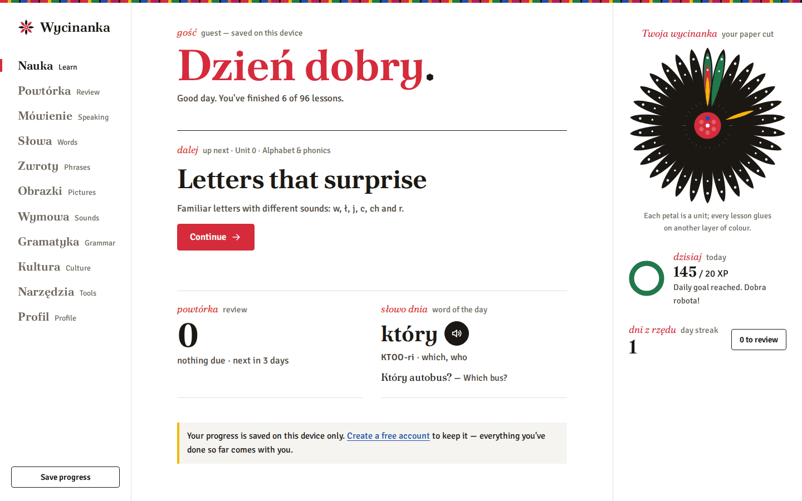
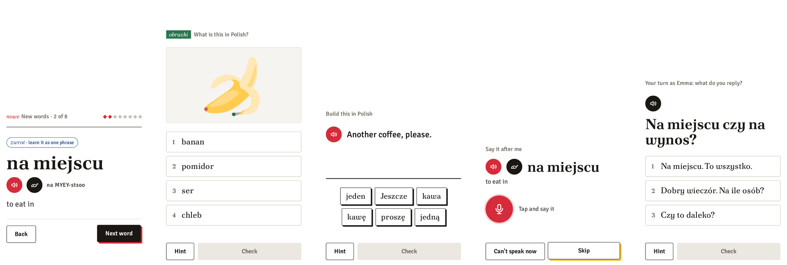
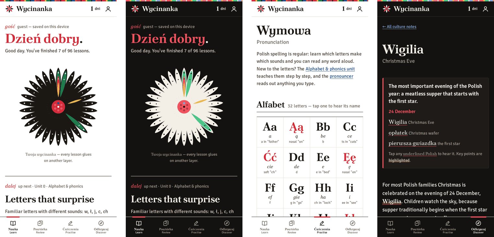
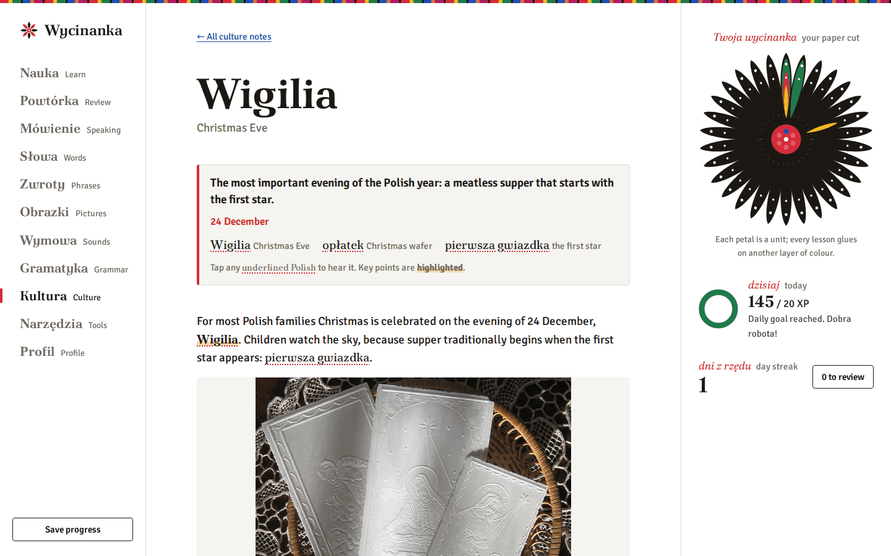
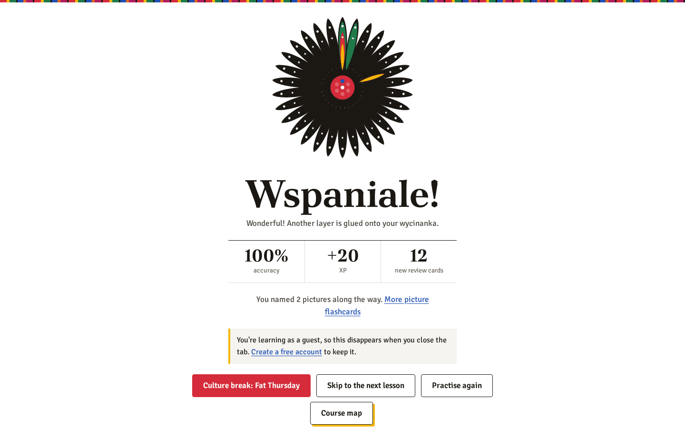

<div align="center">

# Wycinanka

**Learn Polish from scratch: free, private and built to make it stick.**

*vi-chi-NAN-ka*: the Polish folk art of paper cutting. Every lesson you finish glues another layer of colour onto your own paper rosette.

[**Start learning at polish.saluki.cloud →**](https://polish.saluki.cloud)

[](https://github.com/iSaluki/wycinanka/actions/workflows/ci.yml)
[](LICENSE)
[](https://deploy.workers.cloudflare.com/?url=https://github.com/iSaluki/wycinanka)



</div>

## Why Wycinanka?

- **A real course, not a word game.** 96 lessons in 31 units take you from the alphabet to B1: the seven cases, verb aspect, past and future, the conditional, and the everyday situations you'll actually meet.
- **Built for conversation.** Every lesson ends with a dialogue, heard first at natural speed with no text, then answered from the sound alone. Then it's your turn to choose the replies.
- **It remembers what you forget.** FSRS spaced review (the algorithm behind Anki) brings back every word, sentence and grammar rule just before you'd lose it, with extra weight on the things you get wrong.
- **Honest about Polish.** A wrong case ending is a grammar mistake, not a typo, and the feedback names the rule. *dziekuje* isn't *dziękuję*. Accents and endings are what make Polish hard, so that's where the practice goes.
- **Free and private.** No adverts, no email address, no tracking. Learn as a guest, or pick a username to keep your progress on every device. You can export or delete everything at any time.

## Learn by doing

Short lessons of about ten minutes mix new words, pictures, sentence building, speaking and conversation:



- **Hear it, say it, write it.** Every Polish text has a recording from two natural voices, a man's and a woman's. Speaking exercises are checked by speech recognition, and dictation trains the spellings that sound alike (*rz/ż*, *ó/u*).
- **Learn phrases as phrases.** Chunks like *nie ma sprawy* and *mam ochotę na…* are taught whole, with their word-for-word meaning to show why translating piece by piece fails.
- **Wrong answers worth ruling out.** Multiple-choice options are the forms you'd actually confuse: the same word in another case, a word that sounds the same, a plural against its singular.
- **Help when you're stuck.** Hints narrow the options step by step, and finishing below 70% offers a short second round on exactly what you missed.

## More than lessons



- **Review:** a daily spaced-repetition deck, a list of tricky words and revision by unit
- **The 500 most frequent words**, learnt in batches and reviewed in example sentences
- **Picture flashcards:** 72 everyday objects in nine themed decks
- **Speaking practice:** repeat after me, say it in Polish, tongue twisters, and role-playing lesson dialogues
- **Sounds:** an alphabet chart, English-style respellings (*VRO-tswaf*) and a minimal-pair listening game
- **Grammar reference:** the seven cases, a declension explorer and every lesson's notes
- **Tools:** a pronouncer for any word, plus numbers, prices, telling the time and a phrasebook
- **Placement check:** start at your own level
- **Badges and streaks:** 24 badges, a daily goal and optional push reminders

## Polish culture, too

Short articles on Polish traditions and history: Wigilia, Easter, name days, Fat Thursday, paper cutting, the Warsaw Uprising, Solidarity and more. Tap any Polish word to hear it.



## Works everywhere

Wycinanka works on phones and computers, in light and dark mode, and with reduced motion. It installs to your home screen as an app and keeps working offline after one visit. With an account, results you finish offline are sent when you reconnect.

<div align="center">

</div>

## Under the hood

Wycinanka runs entirely on Cloudflare's free plan:
- React and Vite for the front end
- Hono on Workers for the API
- D1 for accounts and progress
- Durable Objects for reminders
- Workers AI (Whisper) for speech recognition in browsers that lack it

Security was designed against the OWASP Top 10: peppered PBKDF2 passwords, hashed session tokens, a strict CSP, and no third-party scripts or tracking.

```sh
npm install
cp .dev.vars.example .dev.vars
npx wrangler dev --local     # app and API on http://localhost:8787
npm test                     # unit and Worker tests
```

- [**Developing and deploying**](docs/DEVELOPING.md): stack, local setup, tests, deploying (including your own copy), security and content
- [**Every feature in detail**](docs/FEATURES.md)
- [**Product and technical plan**](docs/PLAN.md): the research behind the course design
- [**Audit**](docs/AUDIT.md): the September 2026 review and what changed after it

## Licence

The code and original content are under the [MIT License](LICENSE). Third-party assets keep their own licences, listed in [LICENSE](LICENSE):
- the Wikimedia Commons photographs in `public/culture` (each credited in `src/content/culture.ts`, several CC BY-SA)
- the Twemoji pictures in `public/pictures` (CC BY 4.0)
- the recordings made with Piper voices trained on CC0 data
- the word frequency ordering from FrequencyWords (CC BY-SA 4.0)
